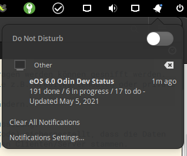

# eOSOdinStatus
A simple python script to notify about progress on elementary OS 6.0 Odin Release.

## Usage
Just run the script with  
`python3 fetchGithubOdin.py` or with  
`python3 fetchGithubOdin.py -n` if you want to get a notification, even if the State of eOS has not changed since last time you checked.

I just run it every 5 minutes with crontab. Dont use the superuser crontab because the pip3 installs deps for your user:  
`chmod +x ./fetchGithubOdin.py`  
`crontab -u USER -e`  
-- add a new line:  
`*/5 * * * * * /bin/bash /path/to/script/runner.sh`
## Requirements
`sudo apt install python3-pip`  
`pip3 install urllib`  
`pip3 install notify-send`  
`pip3 install bs4`
